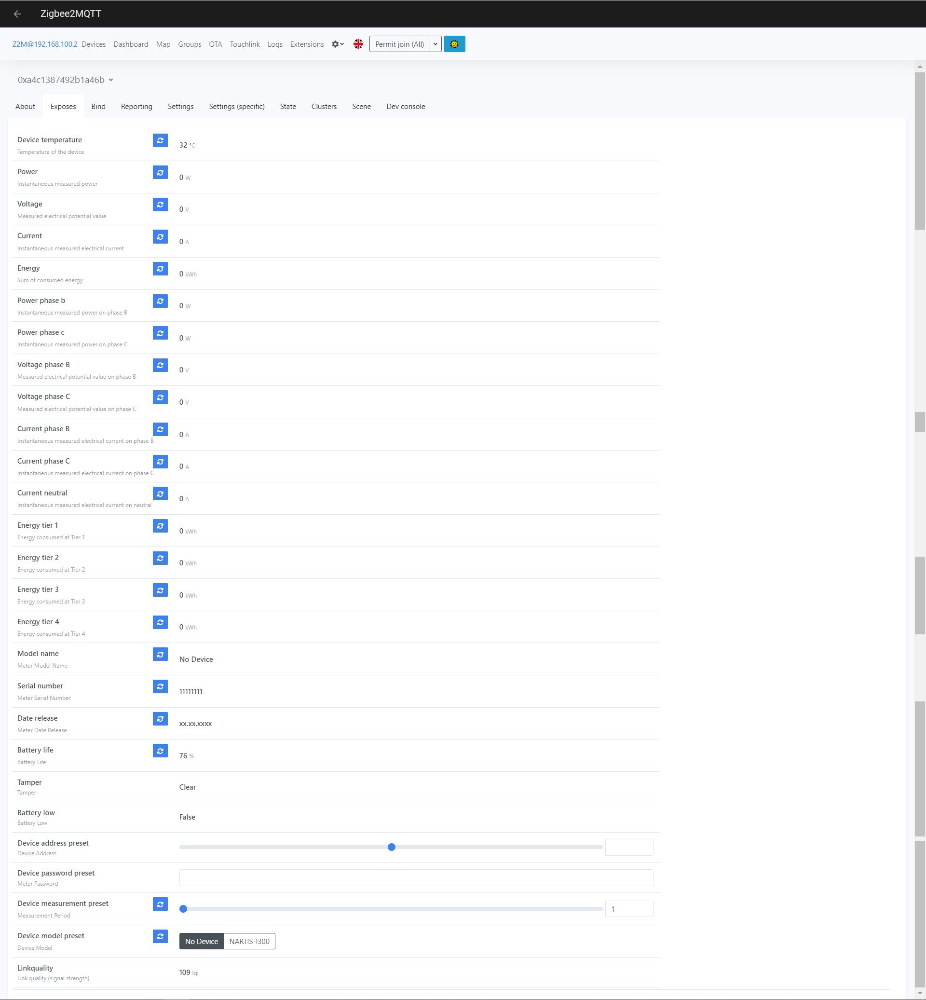

# <a id="Top">ElectricityMeter-ABC-DIY Zigbee TLSR8258</a>

## `ElectricityMeter-ABC-DIY` предназначен для дистанционного мониторинга многотарифных трехфазных счетчиков с последующей передачей показаний в Home Assistant.

**Включает в себя схему оптопорта и `Zigbee` модуль `ZTU` от компани `Tuya`**

[Repository electricity_meter_abc_zrd](https://github.com/slacky1965/electricity_meter_abc_zrd)

---

* [Описание](#description)
* [Железо](#hardware)
* [Компиляция](#compilation)  
* [Загрузка прошивки](#firmware_download)
* [Принцип работы](#firmware)
* [Настройка](#settings)
* [Приборы учета](#electricity_meters)
* [Home Assistant](#home_assistant)

---

## <a id="description">Описание</a>

* `ElectricityMeter-ABC-DIY` рассчитан на взаимодействие через оптопорт с техфазными многотарифными электросчетчиками:

	- [Нартис-И300](#nartis-i300)

* `ElectricityMeter-ABC-DIY` посылает команды электросчетчику и принимает ответы от него. В настоящий момент устройство может прочитать

	- 4 тарифа (в kWh)
	- силу тока по трем фазам в A
	- силу тока нейтрали в А
	- напряжение сети по трем фазам V
	- мощность по трем фазам в kW
	- оставшийся ресурс батарии прибора в %
	- полный серийный номер прибора, например 023230006929
	- дату изготовления прибора, например 02.02.2023

* Сохраняет в энергонезависимой памяти модуля только конфигурационные данные.
* Передает показания по сети Zigbee.
* Взаимодейстивие с "умными домами" через zigbee2mqtt.
* Первоначальная настройка происходит через web-интерфейс zigbee2mqtt.
* Подключиться к сети или покинуть сеть `Zigbee` - удерживать кнопку более 5 секунд (зеленый светодиод должен начать моргать с частотой раз в секунду). Время присоединения к сети - полторы минуты (или пока моргает светодиод).
* Сделать restart `ElectricityMeter-ABC-DIY` - нажать кнопку три раза подряд.
* Однократное короткое нажатие на кнопку - принудительный репорт всех значений.
* `ElectricityMeter-ABC-DIY` питается от источника постоянного тока напряжением 5 вольт через разъем `USB Type-C` и является роутером.
* `ElectricityMeter-ABC-DIY` поддерживает обновление через `OTA` (при обновлении рекоммендуется выбрать счетчик `No Device`).

---

## <a id="hardware">Железо</a>

В проекте используется `Zigbee` модуль `ZTU` от компании `Tuya` на чипе `TLSR8258F1KET32`.

**Схема**

`ElectricityMeter-ABC-DIY` состоит из двух частей. Основной, на которой расположены оптопорт, usb разъем и питание. И модуль zigbee с датчиком температуры. Так сделано для универсальности. К оптопорту можно подключить практически что угодно (модуль на другом чипе, UART-USB преобразователь и т.д.).

Схема основной части с оптопортом.

Схема zigbee на модуле ZTU.

**Плата**

Плата основной части (верх).

Плата основной части (низ).

Плата zigbee части на модуле ZTU (верх).

Плата zigbee части на модуле ZTU (низ).

На гребенку выведены следующие пины модуля

* SWS, GND - для заливки в модуль прошивки
* RST, TX-DBG - на всякий случай, вдруг кому-то пригодится.

Ссылки на проект в easyeda

* [Общая часть](https://oshwlab.com/slacky/electricitymeter_zrd_v3_common)
* [Zigbee ZTU]( https://oshwlab.com/slacky/electricitymeter_zrd_v3_ztu)

**Корпус**

Корпус напечатан на 3D принтере.

[STL файл основания](doc/production/ElectricityMeter_Main.STL)

[STL файл крышки](doc/production/ElectricityMeter_Cover.STL)

[STL файл толкателя](doc/production/ElectricityMeter_Pusher.STL)

[STL файл шайбы](doc/production/ElectricityMeter_Spacer.STL)

[STL файл гайки](doc/production/ElectricityMeter_Screw.STL)

**Готовое устройство**

---

## <a id="compilation">Компиляция</a>

### В описании используются скриншоты из проекта от однофазного счетчика, но сути это не меняет.

[Скачиваем проект](https://github.com/slacky1965/electricity_meter_abc_zrd)  
Если скачали архивом, разворачиваем в какой-нибудь временной директории. Далее запускаем Eclipse. В левом верхнем углу нажимаем File, в развернувшемся меню выбираем Import

Далее выбираем `Existing Project into Workspace` и жмем `Next`.

В открывшемся окне по очереди выбираем 

1. `Browse` - находим директорию, куда скачали и развернули проект.
2. Ставим галочку в `Projects:` на появившемся проекте.
3. Ставим галочку на `Copy projects into workspace`
4. Жмем `Finish`

Все, проект у нас в Эклипсе. 

Далее нужен компилятор и кое-какие утилиты. Компилятор можно скачать у [Telink'a](https://wiki.telink-semi.cn/wiki/IDE-and-Tools/IDE-for-TLSR8-Chips/). Установщик поставит IDE (правленый Эклипс) и компилятор с утилитами. Но мне такой винегрет не нравится, поэтому я пользуюсь обычным Эклипсом и makefile. Так же компилятор есть у [Ai-Thinker](https://github.com/Ai-Thinker-Open/Telink_825X_SDK). Там есть под Windows и под Linux. Так же советую скачать [git bash for windows](https://git-scm.com/download/win). Это позволит писать makefiles, которые будут прекрасно работать и под Windows и под Linux практически без редактирования. Еще понадобится Python, но я думаю, это не проблема. Не забудьте отредактировать в makefile и bootloader.makefile пути к компилятору, если он у вас лежит в другом месте.

Итак, компиляцию начинаем с `bootloader`. Собираем и прошиваем ([как и чем шить чуть ниже](#firmware_download)). Если модуль пустой, то после прошивки `bootloader'a` модуль просто начнет моргать светодиодом. Это нормально.  

Далее компилируем уже саму прошивку и прошиваем.

Если все прошло без ошибок, то модуль запустится и начнет работу.

И последнее - проект сделан таким образом, что его можно вообще собрать без IDE, обычнам make в командной строке.

---

## <a id="firmware_download">Загрузка прошивки</a>

Вопрос - как залить прошивку в модуль. Есть несколько вариантов. Самый простой, это приобрести у Telink их фирменный программатор.

Но он неоправдано дорого стоит. Есть другой, более бюджетный вариант. Заказываем модуль TB-04 или [TB-03](http://www.ai-thinker.com/pro_view-89.html) от Ai-Thinker. Почему-то у самого производителя TB-04 не числится. Но на aliexpress их полно. В них применен TLSR8253. Паяем перемычку согласно фото.

И заливаем прошивку [вот отсюда](https://github.com/pvvx/TLSRPGM/tree/main/sources/UART2SWire/tb-0x-pgm)

Все, у нас есть недорогой программатор, который может загружать прошивки через SWS в модули от Telink'a. Пин D4 (SWM) программатора нужно соединить с пином SWS программируемого модуля, не забыть объединить земли и подкинуть питание на оба модуля.  
Сама программа-прошивальщик лежит [тут](https://github.com/pvvx/TLSRPGM)

---

## <a id="firmware">Принцип работы</a>

Устройство является роутером, питается от сети ~200 вольт и никогда не спит.  
По умолчанию считывание показаний с электросчетчика происходит один раз в минуту. Изменить в большую сторону можно через интерфейс zigbee2mqtt во вкладке Exposes ([подробней о настройках чуть ниже](#settings)).

**Reporting**

Устройство высылает 19 "явных" отчетов. И 8 "скрытых" из интерфеса пользователя.

***Явные отчеты***

* Температура (1)
* Четыре тарифа (4)
* Остаточный процент жизни батарейки электросчетчика (1)
* Серийный номер электросчетчика (1)
* Дата изготовления электросчетчика (1)
* Наименование электросчетчика (1)
* Напряжение сети по трем фазам (3)
* Сила тока по трем фазам и нейтраль (4)
* Мощность по трем фазам (3)

Настроить периоды отправки отчетов, если не устроят по умолчанию, можно в интерфейсе zigbee2mqtt во вкладке reporting([подробней о настройках чуть ниже](#settings)).

***Скрытые отчеты***

* Множитель и делитель тарифов (2)
* Множитель и делитель для напряжения сети (2)
* Множитель и делитель силы тока (2)
* Множитель и делитель для мощности (2)

Настроить периоды отправки "скрытых" отчетов нельзя. Они отпраляются принудительно перед одноименным значением. Например, изменилось напряжение сети. Перед отправкой отчета со значением напражения сети принудительно высылаются два отчета - множитель и делитель напряжения сети. И т.д. Связано с тем, что правильное значение высчитывается в конверторе и множитель и делитель должны быть уже определены до получения значения. В обычном варианте иногда отчеты по множителю или делителю приходили позже значения. В данной схеме с принудительными отчетами множитель и делитель всегда приходят раньше значения.

**Светодиодная индикация режимов модуля**

Красный светодиод сигнализирует о присутствии питания на модуле. Ну и косвенно говорит нам, что программа запустилась и работает. 
Зеленый светодиод служит для информирования о режимах работы модуля.

* Одна вспышка - модуль в сети, считывание данных с электросчетчика успешно.
* Две вспышки - модуль в сети, считывание данных с электросчетчика не происходит.
* Три вспышки - модуль не в сети, считывание данных с электросчетчика успешно.
* Четыре вспышки - модуль не в сети, считывание данных с электросчетчика не происходит.
* Моргает с периодичнойтью раз в секунду - попытка подключения к сети.
	
**Память модуля, прошивка (firmware) и где хранится конфиг**

Согласно спецификации на чип TLSR8258F1KAT32 при использовании `bootloader'a` память распределена следующим образом

		0x00000  Bootloader
		0x08000  Firmware
		0x77000  OTA Image
		0xE6000  NV
		0xFC000  U_Cfg_Info
		0xFE000  F_Cfg_Info
		0xFF000  MAC address
		0x100000 End Flash

`bootloader` ничего не умеет, кроме, как запускать прошивку с адреса 0x8000 и копировать прошивку из области загрузки в область старта при обновлении через ОТА (при обновлении рекомендуется выбрать счетчик `No Device`).

В конфиге сохраняютстя только настройки модуля. Конфиг записывается в NV (0xE6000) в модуле ZTU. Используется модуль NV_MODULE_APP с номером NV_ITEM_APP_USER_CFG (для понимания смотрите app_cfg.h и tl_zigbee_sdk/proj/drivers/drv_nv.h)

В электросчетчиках используются разные протоколы обмена. Дополнительную информацию смотрите в разделе по конкретному [электросчетчику](#electricity_meters).

---
	
## <a id="settings">Настройка</a>

В конфиг `zigbee2mqtt` `configuration.yaml` добавлять ничего не нужно. А конвертор `electricity_meter_abc.js` кладем в директорию `external_converters`, которую нужно создать в корне `zigbee2mqtt`.
		  
Перегружаем `zigbee2mqtt`. Проверяем его лог, что он запустился и нормально работает.

Первоначальная настройка происходит через web-интерфейс `zigbee2mqtt`. Для начала нужно убедиться, что устройство в сети. 

Если во вкладке `devices` его нет, нужно на `ElectricityMeter-ABC-DIY` нажать кнопку и удерживать нажатой не менее 5 секунд, пока не заморгает зеленый светодиод. Итак убедились, что устройство в сети, можно переходить к настройкам. Переходим к вкладке `exposes` устройства.

Видим, что в ячейке `Device model preset` выставлен счетчик `No Device`, т.е. никакой счетчик не выбран, считывание данных не происходит. Выбираем нужный счетчик из предложенных. По умолчанию период опроса счетчика - 1 минута. Если нужно больше (максимальное значение 255 минут), меняем настройку `Device measurement preset`.

---

## <a id="electricity_meters">Электросчетчики, поддерживаемые устройством</a>

### <a id="nartis-i300">Трехфазный многотарифный счетчик Нартис-И300</a>

Счетчик общается по протоколу СПОДЭС.

В настоящий момент устройство может прочитать из счетчика:

* 4 тарифа (в kWh)
* силу тока по трем фазам и нейтраль (в A)
* напряжение сети по трем фазам (в V)
* мощность по трем фазам (в kW)
* оставшийся ресурс батареи прибора (косвенно вычисляется, команды такой нет, в %)
* полный серийный номер прибора (например 023230006929)
* дату изготовления прибора (например 02.02.2023)

У этого счетчика нет команды запроса ресурса батареи. Поэтому оставшийся ресурс вычисляется между текущей датой прибора, датой производства.

---

Если счетчик выбран и устройство примагничено к окошку оптопорта счетчика, то в `exposes` web-интерфейса `zigbee2mqtt` получим примерно такую картинку.

Если данные не считываются, есть несколько причин.

* Выбран не тот счетчик.
* Не введен адрес счетчика, где он требуется.
* Не совмещены светодиод и фототранзистор на устройстве и счетчике. Рекомендуется немного подвигать устройство.
* Правильное позиционирование `ElectricityMeter-ABC-DIY` на счетчике - USB разъемом вниз

---

## <a id="home_assistant">Home Assistant</a>

В результате вы получите примерно вот такую картинку.

Связаться со мной можно в **[Telegram](https://t.me/slacky1965)**.

### Если захотите отблагодарить автора, то это можно сделать через [ЮMoney](https://yoomoney.ru/to/4100118300223495)

## История версий
- 1.0.01
	- Добавлен счетчик Нартис-И300

[Наверх](#Top)
